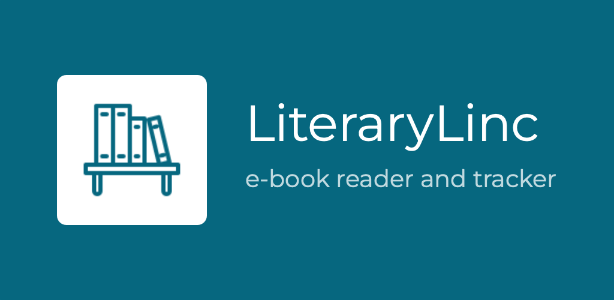

# LiteraryLinc

A feature-rich e-book reader and book tracking application for Android that helps you manage your reading library.

## Features

- **E-book Reader**: Built-in document viewer supporting multiple formats including PDF, EPUB, and CBZ.
- **Book Tracking**: Track your reading progress, completion dates, and personal ratings
- **Library Management**: 
  - Organize books with metadata (title, author, ISBN, genre, etc.)
  - Track reading status and progress
  - Record pages read for series
  - Add personal notes and ratings
- **File Management**:
  - Automatic document scanning
  - Cover image management
  - Multiple directory support
- **Data Management**:
  - CSV backup and restore functionality
  - Book list and reading history
- **Analytics**: View statistics about your reading habits

## Installation

Download the latest release APK from the [releases page](https://github.com/Enoch02/LiteraryLinc/releases)

The app supports the following architectures:

- armeabi-v7a
- arm64-v8a
- x86
- x86_64

## Building from Source

### Requirements

- Android Studio
- JDK 17+
- Android SDK with minimum API level 24

### Steps

1. Clone the repository
2. Open in Android Studio
3. Sync Gradle files
4. Build the project using `./gradlew build`

## License

This project is licensed under the GNU General Public License v3.0 - see the [LICENSE](LICENSE) file for details.

## Acknowledgments

### App Icon Attribution

<a href="https://icons8.com/icon/23662/book-shelf">Book Shelf</a> icon by <a href="https://icons8.com">Icons8</a>

### Libraries

The app uses several open source libraries like [mupdf-android-fitz](https://github.com/ArtifexSoftware/mupdf-android-fitz). See the Licenses screen in the app for a complete list. 
